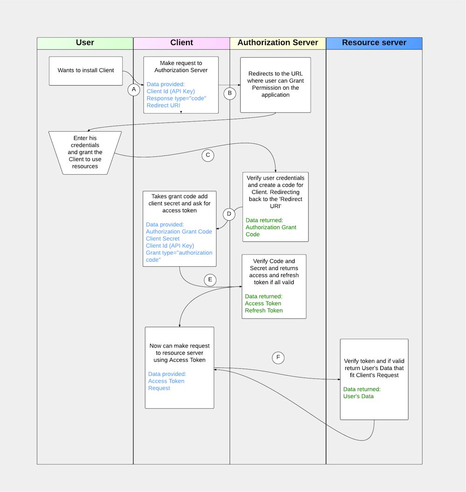

===============================
Tutorial: Obtain Nimble API Key
===============================

.. contents::

Introduction
------------

This document will describe authorization flow that return the authorization token that allow to make requests to Nimble API and access resources 
to which access has been granted for user. For For authorization Nimble use OAuth 2.0 protocol with bearer tokens. All technical details can be 
read in `RFC6749 <http://tools.ietf.org/html/rfc6749>`_ and `RFC6750 <http://tools.ietf.org/html/rfc6750>`_, but you don't need to read them 
(unless you want to know more details on OAuth 2.0) — every detail that need to obtain access token and use this token for requesting resource on 
behalf of user will be described in this document.
 

Terminology
-----------
**User**
    Person who has an account inside Nimble and owner of resources to which API provide access

**Client**
    Service that request a token and want to make requests to the Nimble API on behalf of User

**Authorization server**
    Server that allow User to grant access for Client to use his resources

**Resource server**
    Server that returns User's resources to Client if it was granted for access by User

**Bearer token**
    Token that Client received after User has granted access. Possession of this token allows client to make requests to Resource server in order 
    to receive Client's resources.

Prerequisites
-------------
In order to create a Client for Nimble API you need to have to register your application in our DB and get Client Secret and Client Id. 
Its can be done on the page with this link: https://developers.nimble.com/user/register. You probably have done this already.

Authorization process overview
------------------------------
For giving you a good overview of process we will use scheme and give a brief explanation to the each step on scheme. Steps are shown by the arrows and has a letters assigned to each step on scheme.

.. _auth-process-image:

Let's go over a scheme step by step.

* **Step A** — You have some product (Client) that wants to use Nimble Data for some purposes. User wants to use Client and you need to retrieve a grant of user to operate the data from Nimble on his behalf. So, user has something that allows to initiate this process from Client.

* **Step B** — Your client open a page that points to Authorization Server providing a params specified on scheme. As a params, you need to send  your API key and URI of client to which Authorization Grant Code will be returned. For details see: :ref:`request-grant-code`.

* **Step C** — Auth server using your API Key (Client Key) creates a link to which user will be directed and send a redirect response. User will be automatically redirected to the page where he can put his credentials and grant access. Note that now user is on side of Authorization Server.

* **Step D** — As soon as user finished a process of providing access, Authorization Server takes a redirect URI that you specified on step B and sends code to that URI. Response details :ref:`explained here <token-response-details>`.

* **Step E** — Using this code you make a `application/x-www-form-urlencoded` request to the Authorization Server where in body you put code retrieved on previous step, your Client Secret, Client Id and Grant Type you want to receive. It is always `authorization_code`. For details see: :ref:`request-access-token`.

* **Step F** — If everything is valid then you will receive response from server with Access Token and Refresh Token. Now you are able to do a requests to the Nimble API using Access Token until it valid. Using Refresh Token you will be able to renew this token without involving User second time. For details see: :ref:`token-refresh`.

.. _request-grant-code:

Requesting Authorization Grant Code
-----------------------------------
You should use this request on step B of :ref:`Authorization Process<auth-process-image>`. You need to open a page for user with this endpoint and provide a Redirect URI on which your handler will be able to catch the code from Authorization Server that will be returned when User successfully grant you a permission to use Nimble API.

**Endpoint**::

   GET https://api.nimble.com/oauth/authorize

**Params**:
    **client_id** 
        *required* — Your Client Key from Application Page.
    **redirect_uri** 
        *required* — URI where you have a handler who will catch a code and finish the Process 
    **response_type**
        *required* — must be set to "code". We don't support Implicit Flow, so ``code`` must be always sent here. 
    **scope**
        *optional* — for now it is only one scope for Nimble API, so skip this parameter for now.
 

**Example request**::

    GET https://api.nimble.com/oauth/authorize?client_id=5f96b5e9adaxzca93x1213123132&redirect_uri=https://yourportal.com&response_type=code

**Successful response**:

    First, user will be redirected to the page on Authorization Server with hostname ``https://developers.nimble.com/oauth/login.php``

    As soon as he provided his credentials, you will receive a request like listed below on your ``Redirect URI``::

       https://yourportal.com?code=LTM4MjQ3MTk2OjEzYTU5ZjY2NTkxOjZiOGQ= 

**Error response**:

    If the request is missing or has incorrect parameters, the user-agent will be redirected back to the redirect URI provided.
    The redirection will contain parameters specifying the error.

    *Example Invalid Authorization Request Redirect*::
    
        http://www.myapp.com/oauth?error=invalid_request&error_description=Invalid%20URL

    After selecting Login, the user will be validated. If user validation is successful, a consent page is displayed. If user validation is unsuccessful, 
    the user-agent will be redirected to the redirect URI provided in the initial request. This redirection will include additional parameters 
    specifying the error.

    *Example Unsuccessful Validation Redirect*::
    
        http://www.myapp.com/oauth?error=access_denied&error_descripton=Validation%20errors

    If user click Deny on the grant permission page then another error will be sent.

    *Example Deny Consent Redirect*::
    
        http://www.myapp.com/oauth?error=access_denied&error_description=User%20denied%20access

 
.. _request-access-token:

Requesting Access Token
-----------------------
As soon as User complete step C your handler will catch step D. You need to listen for redirect on your Redirect URI. **Code returned to you isn't access token yet!** You still need to obtain the authorization token. Note, that this code is valid for a short period time and if you not intiate request to access token as soon as you receive a code then received code can become invalid and User will need to reinitiate a process once again. So, on step E you need to receive access to token for which user granted you. 

The Client should use the authorization code obtained to request an access token. When requesting an access token, you SHOULD specify required data as form parameters. Client application secret is needed for client authentication. When specifying client_id and client_secret as form parameters, the ``Content-Type`` header MUST be set to ``application/x-www-form-urlencoded``. Request should be done via HTTPS only.

 

**Endpoint**::

 POST https://api.nimble.com/oauth/token

**Params**:

    **client_id**
        *required* — your Client API key.
    **client_secret**
        *required* — your Client Secret key
    **code**
        required* — code that you received on step D. This code has a short-valid time, so initiate request for token as soon as you receive it.
    **grant_type**
        *required* — must be set to ``authorization_code``. You need to receive an Access token.
 

**Headers**:

    ``Content-Type: application/x-www-form-urlencoded; charset=UTF-8``
        *required* — you need to specify this header always
    ``Accept: application/json``
        *optional* — if you want to receive the response in ``JSON`` format, not in ``XML``.
 

**Example Request**::

    POST /oauth/token HTTP/1.1
    Host: api.nimble.com
    Content-Type: application/x-www-form-urlencoded; charset=UTF-8

    Body : client_id=5f96b5e9a6b7478e1537574a42615063&client_secret=2d78885526dc3c5e& code=LTM4MjQ3MTk2OjEzOTQ1YjQ3ODJhOi0yNjRl&grant_type=authorization_code

 
.. _token-response-details:

*Successfull Response XML*:

.. code-block:: xml

    <OAuth20>
        <access_token>
            <token>d38ab9d959346db4396fa459494cd70e</token>
            <scope>scope1</scope>
            <refresh_token>529e176a5c38a44b74b1cd2f8f03f4631c66c7e7</refresh_token>
            <token_type>bearer</token_type>
            <expires_in>86399</expires_in>
        </access_token>
    </OAuth20>
 

*Successfull Response JSON*:

.. code-block:: javascript

    {
        "OAuth20": {
            "access_token": {
                "token": "20dfabc53c0c175445d7551f934e8127",
                "scope": "scope1",
                "refresh_token": "fda676baf8fc14646ebcf117cd0dbef36c71b918",
                "token_type": "bearer",
                "expires_in": 86399
            }
        }
    }

// TODO specify errors requests

API requests using Access Token
-------------------------------
Now when we have Access Token Received you need to store it and use for any requests for Nimble Data on behalf of user. 

In order to use this token code you just add it into url as request parameter with name ``access_token``.

**Endpoint**:

Any of available endpoint of Nimble API
 
**Params**:

No matter what request ``POST``, ``GET`` or any other HTTP method, just add an ``access_token`` as parameter.

    **access_token**
        *required* — put a token for user under this parameter. 
 

**Example Request**::

    https://api.nimble.com/api/v1/contacts?keyword=test&access_token=e0f7b053200672c2ff6ede59c8e2bfc7

 
**Successful Response**:

Some data depends on API call you requested

 
// TODO specify invalid token or expired token error

 
.. _token-refresh:

Refresh token after expiration without user input
-------------------------------------------------
// TODO this section under development

 

Troubleshooting & Feedback
--------------------------
If you have any problems or want to submit feedback feel free to go to our support forum or email us at care@nimble.com

 

Examples
--------
For your convinience we created some examples:

`Live example with API Console <https://developers.nimble.com/console>`_. Go by link and select OAuth2 in Authorization dropdown. You will be able to see process from user standpoint

`Python authorization example <https://github.com/nimblecrm/python-example>`_. Actual code implementation on Python and Tornado

`Ruby authorization example <https://github.com/nimblecrm/ruby-example>`_. Implementation of authorization process in Ruby
