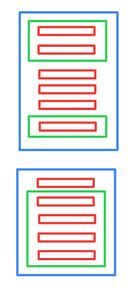

====================
Nimble API Responses
====================

.. contents::

.. _contact-details-response:

Contacts details
----------------

Typical response to this request is a dictionary with 2 keys (unless otherwise specified by the specific API): meta and resources. 

.. _contact-resources-response:

Contact resources
~~~~~~~~~~~~~~~~~

This field usually contains all data for the contacts you've requested. Here is an example of a Nimble contact

.. code-block:: javascript

    "resources": [
        {
            "updated": "2012-09-07T16:49:56+0300",
            "created": "2012-09-07T16:49:56+0300",
            "fields": {
                "parent company": [
                    {
                        "modifier": "",
                        "extra_value": "5c459c56ceee1868ee3ab468",
                        "value": "Nimble",
                        "label": "parent company"
                    }
                ],
                "description": [
                    {
                        "value": "description",
                        "label": "description",
                        "modifier": "other"
                    },
                    {
                       "value": "description",
                       "label": "description",
                       "modifier": "linkedin"
                    }
                ],
                "last name": [
                    {
                        "modifier": "",
                        "value": "Akopyan",
                        "label": "last name"
                    }
                ],
                "phone": [
                    {
                        "modifier": "mobile",
                        "value": "+7 (917) 202-456-1111",
                        "label": "phone"
                    },
                    {
                        "modifier": "home",
                        "value": "+7 244 231 84 22",
                        "label": "phone"
                    }
                ],
                "URL": [
                    {
                        "modifier": "other",
                        "value": "https://nimble.com",
                        "label": "URL"
                    },
                    {
                        "modifier": "other",
                        "value": "https://app.nimble.com",
                        "label": "URL"
                    }
                ],
                "source": [
                    {
                        "modifier": "",
                        "value": "csv",
                        "label": "source"
                    }
                ],
                "address": [
                    {
                        "modifier": "other",
                        "value": "{'city': 'Dushanbe', 'street': 'First str. 15', 'zip': '54055', 'country': 'Farganistan'}",
                        "label": "address"
                    }
                ],
                "email": [
                    {
                        "modifier": "other",
                        "value": "fake_person@nimble.com",
                        "label": "email"
                    }
                ],
                "first name": [
                    {
                        "modifier": "",
                        "value": "Amayak",
                        "label": "first name"
                    }
                ]
            },
            "object_type": "contact",
            "id": "5049fb849b85f669e40000dc",
            "last_contacted": {
                "user_id": "5c459c52ceee1868ee3ab41f",
                "deletion_tstamp": null,
                "type": "LCType<message>",
                "object_id": "ed5afbee-37f5-db6b-7f71-c7d6b8750bbb",
                "tstamp": "2019-01-22T21:57:30+0000"
            },
            "avatar_url": "https://app.nimble.com/api/contacts/avatars/5049fb849b85f669e40000dc",
            "record_type": "person",
            "creator": "Emil Kio",
            "children": [],
            "tags": [
                {
                    "tag": "csv import",
                    "id": "5049fa0c9b85f62cb4000639"
                }
            ],
            "owner_id": "5049f696a694620a0700001c"
        }
    ]
    
Here is a description of the response in detail:

**updated**
    Timestamp of contact's last update time
    
**created**
    Timestamp of contact's creation time
    
**fields**
    Dictionary containing contact's fields data. Keys are field names and values are lists of field values. All default contact fields 
    are :ref:`described here <contact-fields>`.

**object_type**
    String specifying document type. For contacts it's ``contact``.

**id**
    Unique contact id in BSON format.
    
**last_contacted**
    Information about last outbound message to this contact (if any). Contains following fields.
        * *user_id* — unique id of owner in BSON format
        * *object_id* — id of object of corresponding type in BSON format
        * *type* — last contacted provider's type
        * *tstamp* — timestamp of last outbound message
        * *deletion_tstamp* — timestamp of object deleting

**avatar_url**
    URL of image that can be used as contact's avatar. Value of null is used to indicate that contact has no avatar associated.
                    
**record_type**
    Type of contact.  This can have one of two values: ``person`` and ``company``.
    
**creator**
    Name of the person who created the contact
    
**children**
    For ``company`` contacts this field contains list of ``person`` contacts associated with the company.
    
**tags**
    List of tags associated with the contact. Each tag is represented as a dictionary having following keys.
        * *tag* — tag's text
        * *id* — unique id of tag in BSON format
    
**owner_id**
    Id of the person owning the contact in BSON format
        
.. _legacy_contacts-meta-response:

Legacy contacts metadata
~~~~~~~~~~~~~~~~~~~~~~~~

Contact's metadata contains information about all basic and custom fields created in Nimble for a user. Below is it's typical structure. Please note that this listing doesn't contain all metadata as the full list is very big.  The typical records are shown here. All default contact fields are :ref:`described here <contact-fields>`.

.. code-block:: javascript

    "contacts_meta": {
        "fields": {
            "first name": [
                {
                    "group": "Basic Info",
                    "name": "first name",
                    "label": "first name",
                    "modifier": "",
                    "presentation": {},
                    "id": "5049f697a694620a07000043",
                    "multiples": false
                }
            ],
            "email": [
                {
                    "group": "Contact Info",
                    "name": "email",
                    "label": "email",
                    "modifier": "other",
                    "presentation": {},
                    "id": "5049f697a694620a07000065",
                    "multiples": true
                },
                {
                    "group": "Contact Info",
                    "name": "email",
                    "label": "email",
                    "modifier": "personal",
                    "presentation": {},
                    "id": "5049f697a694620a07000064",
                    "multiples": true
                }
            ],
            "lead status": [
                {
                    "group": "Lead Details",
                    "name": "lead status",
                    "label": "lead status",
                    "modifier": "",
                    "presentation": {
                        "width": "1",
                        "next_id": "5",
                        "values": [
                            {
                                "id": "1",
                                "value": "Open"
                            },
                            {
                                "id": "2",
                                "value": "Contacted"
                            },
                            {
                                "id": "3",
                                "value": "Qualified"
                            },
                            {
                                "id": "4",
                                "value": "Unqualified"
                            }
                        ],
                        "type": "select-box"
                    },
                    "id": "5049f697a694620a0700008d",
                    "multiples": false
                }
            ]
        },
        "groups": {
            "Basic Info": {
                "name": "Basic Info",
                "order": [
                    "first name",
                    "last name",
                    "middle name",
                    "company name",
                    "title",
                    "parent company",
                    "source",
                    "last contacted"
                ],
                "is_standard": true,
                "label": "Basic Info",
                "type": "both",
                "id": "5049f696a694620a07000031"
            }
        }
    }
    
Here is a description of the response in detail:
    
**fields**
    Information about the fields in Nimble. Represented by dictionary where keys are fields names, and values are lists containing details about 
    all possible modifications of this field. If field have no modifiers (like ``first name`` on example above), this list contains only one element.
    
    Information stored in dictionaries with following keys:
        * *group* — unique name of the group containing this field.
        * *label* — unique name representing the field in human-readable form.
        * *modifier* — name of the field's modifier
        * *id* — unique id of the field in BSON format
        * *multiples* - indicates whether field could have multiple values (under different modifiers).
        * *presentation* - dict with the information which should help to display this field on client.
    
**groups**
    Information about field groups. Represented by dictionary where keys are unique group names and values are dictionaries with more info. Groups info dictionary contains following fields:
        * *id* — unique id of the group in BSON format.
        * *order* — list containing names of the fields as they appeared in group.
        * *name* — unique name of the group. (Outdated: as we have field name as the key of ``groups`` dictionary.)
        * *label* — unique name representing the field in human-readable form.
        * *is_standard* - whether this group belongs to standard Nimble groups.
        * *type* - type (belonging) of group, could be among ``person``, ``company``, ``both``.

.. _contacts-meta-response:

Contacts metadata
~~~~~~~~~~~~~~~~~

Contact's metadata contains information about all basic and custom fields created in Nimble for a user. Below is it's typical structure. All default contact fields are :ref:`described here <contact-fields>`.

.. code-block:: javascript

    {
      "tabs": [
        {
          "tab_id": "string",
          "tab_name": "string",
          "contact_types": "person",
          "is_standard": true,
          "members": [
            {
              "type": "group",
              "name": "string",
              "group_id": "string",
              "logo_id": "string",
              "fields": [
                {
                  "type": "field",
                  "name": "string",
                  "field_id": "string",
                  "modifier": "string",
                  "multiples": true,
                  "read_only": true,
                  "field_type": {
                    "field_kind": "string",
                    "validation_rule": {
                      "type": "email"
                    }
                  },
                  "presentation": {
                    "number_type": "integer"
                  },
                  "available_actions": "edit_all"
                }
              ]
            }
          ],
          "available_actions": "edit_all"
        }
      ]
    }

Here is a description of the response in detail:

**tabs**
        * *tab_id* — unique id of the tab.
        * *tab_name* — name representing the tab in human-readable form.
        * *contact_types* — contact types that could have fields of the tab. Possible values: ``person``, ``company``
        * *is_standard* — whether this tab belongs to standard Nimble tabs.
        * *available_actions* - possible values: ``edit_all``, ``rearrange_only``, ``view_only``.
        * *members* - list of tab members. Its could be groups and fields without groups.

**groups**
        * *type* — tab member type. It is always "group" here.
        * *name* — name representing group in human-readable form.
        * *group_id* — unique id of the group.
        * *logo_id* — id of logo to show
        * *is_standard* - whether this group belongs to standard Nimble groups.
        * *fields* - list of fields contained in group.

**fields**
        * *type* — tab member type. It is always "field" here.
        * *name* — name representing field in human-readable form.
        * *field_id* — unique id of the field.
        * *modifier* — name of the field's modifier
        * *multiples* - indicates whether field could have multiple values (under different modifiers).
        * *read_only* - if field values available for editing
        * *field_type* - dictionary describing field type. More details are at :ref:`described here <field-type>`.
        * *presentation* - dictionary describing how field should be presented in Nimble client. More details are at :ref:`described here <field-presentations>`.
        * *available_actions* - possible values: ``edit_all``, ``edit_choices_only``, ``view_only``.

The image below shows schema of fields metadata. Blue rectangle - tab, green rectangle - group, red rectangle - field. As you can see, fields could be a member of a tab or a group.

.. _contact-list-response:

Contact list
------------
Contact list request is similar to :ref:`contact-details-response`. It has the same key with resources, :ref:`described here <contact-resources-response>`. Difference is in ``meta`` key value. For contact listing it returns pagination details. 

.. include:: /data_structures/commons/paging_metadata.rst

.. _api-errors:

API Errors
----------

Errors in Nimble are returned as a JSON dictionary with appropriate HTTP error codes and following keys:

**message**
    Message about the error
**code**
    Extended error code

.. _validation-error:

Validation Error
~~~~~~~~~~~~~~~~
Sent on invalid parameters. Returns with HTTP code 409 and code field equal to 245.

This response looks like common error dictionary:

.. code-block:: javascript

    {
        "message": "You can specify either `keyword` or `query` parameter, not both!", 
        "code": 245
    }
    
    
On contact creation and update — additional data is returned. 

.. code-block:: javascript

    {
        "message": "Validation errors",
        "code": 245,
        "errors": {
            "first name": [{
                "message": "First name or last name field is required for person and should not be empty",
                "field_id": "5049f697a694620a07000043"
            }]
        }
    }

Here errors are a dictionary, containing information about field that caused the error. Key is field name and values are extended error message and unique id of the field that caused the error.

.. _quota-error:

Quota Error
~~~~~~~~~~~
Sent if user exceeded his quota values. Returns with HTTP code 402 and code field equal to 108.

.. code-block:: javascript

    {
        "message": "You have created the maximum number of contact records allowed for your subscription.\nDon't worry, you can upgrade your account and add more contacts right now.", 
        "code": 108
    }
    
.. _server-error:

Server error
~~~~~~~~~~~~
Sent if unrecoverable Nimble server occurs. Returns with HTTP code 500 and code field equal to 107.

.. code-block:: javascript

    {
        "message": "Internal error handling request", 
        "code": 107
    }

.. _notfound-error:

NotFound Error
~~~~~~~~~~~~~~~~
Sent on attempt to get some object by invalid identifier (in most cases identifier of object is its ID in our database).

This response will contain dictionary with `object_type` and `object_id` fields:

.. code-block:: javascript

    {
        "object_type": "contact field",
        "object_id": "111111111111111111111111"
    }
